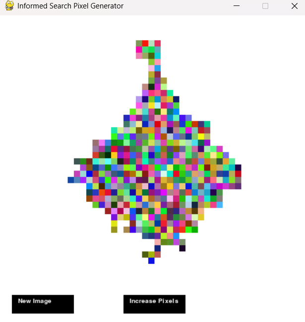

Pixel generation game using heuristic search algorithm:

**How it works:**

Algorithm starts from a single pixel and expands outward, choosing new pixels based on priority. 

*Step-by-Step Process:*
1- Start from a random pixel (e.g., (x, y) = (5, 5))
2- Push the pixel into a priority queue (heapq)
3- Expand to neighboring pixels (up, down, left, right)
4- Prioritize which pixel to expand next using a heuristic function
5- Repeat until enough pixels are drawn

- Pixels are sorted by priority using heapq (a min-heap in Python).
- The lower the priority number, the sooner a pixel gets processed.
- The heuristic function helps determine priority using Manhattan Distance.
- Pixels closer to the center get processed first. This makes pixels spread outward in a structured way, instead of randomly.
- The expansion process picks a random start pixel, then adds it to the priority queue with priority 0.
- Algorithm looks at neighbors (up, down, left, right). If not visited, it calculates priority based on this unformation:

Visualization: 
If the center is the goal, pixels expand outward in a controlled way.
        -  -  -  -  -  
        -  X  X  X  -  
        -  X  O  X  -  
        -  X  X  X  -  
        -  -  -  -  -  
The center pixel "O" starts first.
The closest pixels "X" get priority and expand first.
Further pixels "-" are processed later.

**How to play:**
1- Download the zip file or clone the repo.
2- Create a virtual environment and install the requirements.txt file using pip.
3- Run the script image_search_game.py from python terminal. A new window will open, enjoy the game!
